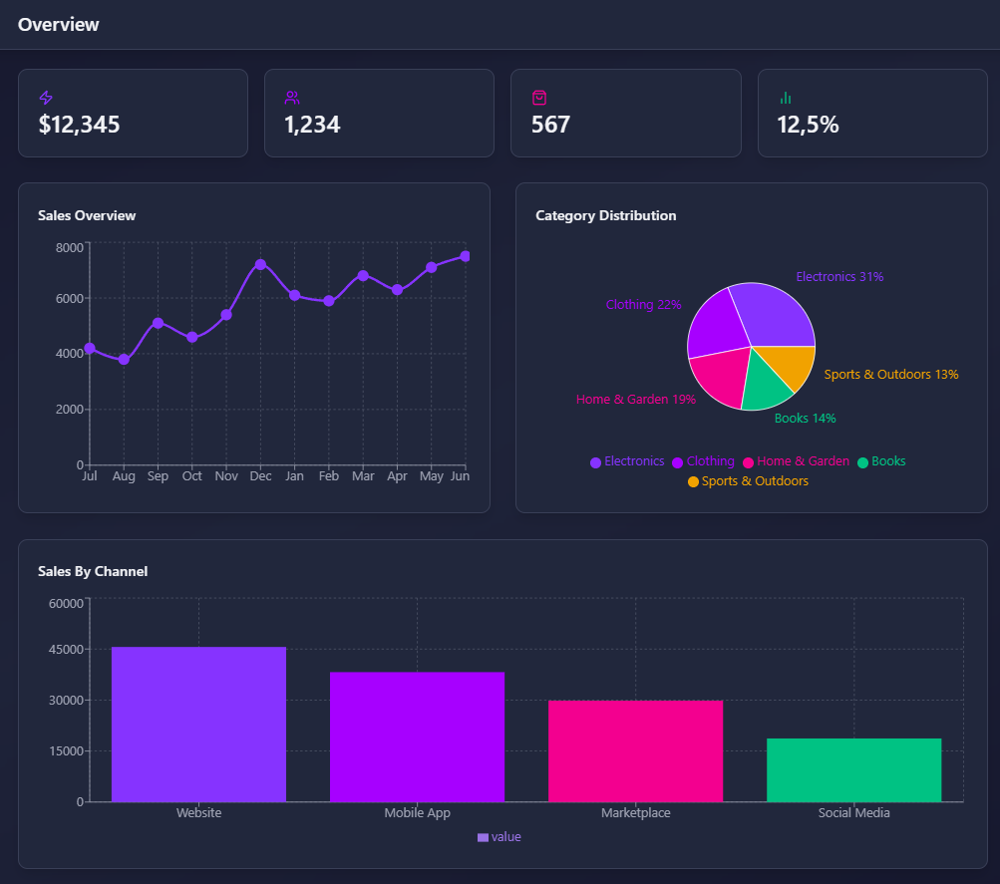

# Admin dashboard
## Technologies
- React
- JavaScript
- Tailwind CSS
- Framer Motion
- Recharts
## How to launch
1. ```npm install``` - installing dependencies
2. ```npm run dev``` - launching a project in development mode
3. ```npm run build``` - launching a project in production mode


